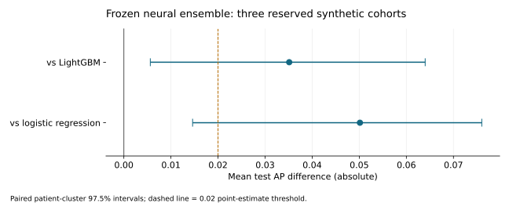

# Neural model search and independent confirmation

**Synthetic results only. Real client data has not been evaluated.**

The neural candidate met the predefined synthetic **average-precision** superiority criterion against both original references. This is a qualified result: it did not significantly outperform the tuned logistic control, lost to LightGBM on cohort 7302, and captured fewer positives than LightGBM at top 10% in all three reserved cohorts. It is provided as an opt-in challenger; the default benchmark remains available.

The study completed 165 development fits: 55 configurations on cohorts 42, 43 and 44. It selected one fixed candidate from 550 individual and ensemble proposals, then evaluated it on reserved cohorts 7301, 7302 and 7303. The generator, label, 70 wide predictors, patient-disjoint temporal split and original reference parameters were unchanged.

## Primary result

The predefined criterion required at least **0.02 absolute mean test AP improvement against each original reference**, and a positive lower confidence bound for both comparisons.

|                           |   7301 |   7302 |   7303 |   Mean AP |
|:--------------------------|-------:|-------:|-------:|----------:|
| Neural ensemble           | 0.4205 | 0.3752 | 0.4282 |    0.4079 |
| LightGBM reference        | 0.3132 | 0.4110 | 0.3942 |    0.3728 |
| Selected LightGBM control | 0.3132 | 0.4110 | 0.3942 |    0.3728 |
| Logistic reference        | 0.3554 | 0.3757 | 0.3423 |    0.3578 |
| Selected logistic control | 0.4047 | 0.4053 | 0.3841 |    0.3980 |

| Reference          |   Mean AP gain |   97.5% lower |   97.5% upper | Passes   |
|:-------------------|---------------:|--------------:|--------------:|:---------|
| LightGBM reference |         0.0351 |        0.0056 |        0.0640 | True     |
| Logistic reference |         0.0501 |        0.0146 |        0.0760 | True     |

Intervals use 2,000 paired patient-cluster draws within each cohort, with equal cohort weight. Each is a 97.5% interval, adjusted for two original-reference comparisons using Bonferroni family alpha 0.05. The 0.02 threshold applies to the point estimate, not the lower bound. These intervals condition on fitted models and the observed cohorts; they do not quantify retraining uncertainty.

## Selected model

The frozen neural ensemble achieved mean development validation AP **0.411953**. It uses the same members, hyperparameters and probability weights across every cohort:

| Member      | Family   |   Weight |
|:------------|:---------|---------:|
| realmlp_3   | realmlp  | 0.200000 |
| realmlp_0   | realmlp  | 0.200000 |
| realmlp_1   | realmlp  | 0.200000 |
| tabm_08     | tabm     | 0.200000 |
| mlp_tuned_2 | mlp      | 0.200000 |

No LightGBM predictions are included. Exact parameters and provenance are in the [frozen recipe](neural_study/frozen_recipe.json). Recipe SHA-256: 4935c539d91f91ead8db44f9cad560cca79284732694042388ce56207d0a7e91.

## Development evidence

The search comprised 15 TabM variants, 6 residual MLPs, 4 RealMLPs, 4 conventional MLPs, 4 TabICL variants, 2 TabPFN variants, 11 LightGBMs and 9 logistic regressions. It adaptively refined preprocessing, feature selection, regularization, class weights and ensembles using development validation only. The final ensemble search included 512 deterministic convex blends of the top ten neural configurations, alongside individuals and top-2/3/5 equal blends.

| candidate          |     42 |     43 |     44 |   Mean validation AP |
|:-------------------|-------:|-------:|-------:|---------------------:|
| realmlp_3          | 0.3335 | 0.4201 | 0.4642 |               0.4059 |
| realmlp_0          | 0.3236 | 0.4301 | 0.4594 |               0.4043 |
| realmlp_1          | 0.3162 | 0.4373 | 0.4477 |               0.4004 |
| tabm_08            | 0.3124 | 0.4212 | 0.4510 |               0.3949 |
| lightgbm_reference | 0.3273 | 0.3709 | 0.4794 |               0.3925 |
| lightgbm_tuned_4   | 0.3300 | 0.3958 | 0.4481 |               0.3913 |
| mlp_tuned_2        | 0.3322 | 0.3756 | 0.4509 |               0.3862 |
| tabm_10            | 0.3284 | 0.3661 | 0.4625 |               0.3857 |
| tabpfn_full        | 0.3250 | 0.3868 | 0.4408 |               0.3842 |
| mlp_tuned_0        | 0.3152 | 0.3844 | 0.4449 |               0.3815 |
| lightgbm_tuned_2   | 0.3077 | 0.3804 | 0.4560 |               0.3814 |
| tabm_06            | 0.3040 | 0.4078 | 0.4304 |               0.3807 |

Validation evidence is optimistic after tuning. The [complete trials](neural_study/development_trials.csv) and [ranking](neural_study/development_ranking.csv) retain every configuration and cohort. A favorable development cohort alone was not enough to declare a winner.

## Reserved cohorts and capacity

|   cohort |   snapshots |   patients |   positives |
|---------:|------------:|-----------:|------------:|
|     7301 |        1597 |        534 |         107 |
|     7302 |        1721 |        575 |         137 |
|     7303 |        1643 |        549 |         173 |

At equal top-10% snapshot capacity:

|   cohort | model                     |   selected_count |   selected_positives |   total_positives |   recall |
|---------:|:--------------------------|-----------------:|---------------------:|------------------:|---------:|
|     7301 | Neural ensemble           |              160 |                   49 |               107 |   0.4579 |
|     7301 | LightGBM reference        |              160 |                   52 |               107 |   0.4860 |
|     7301 | Logistic reference        |              160 |                   49 |               107 |   0.4579 |
|     7301 | Selected LightGBM control |              160 |                   52 |               107 |   0.4860 |
|     7301 | Selected logistic control |              160 |                   51 |               107 |   0.4766 |
|     7302 | Neural ensemble           |              173 |                   65 |               137 |   0.4745 |
|     7302 | LightGBM reference        |              173 |                   67 |               137 |   0.4891 |
|     7302 | Logistic reference        |              173 |                   58 |               137 |   0.4234 |
|     7302 | Selected LightGBM control |              173 |                   67 |               137 |   0.4891 |
|     7302 | Selected logistic control |              173 |                   65 |               137 |   0.4745 |
|     7303 | Neural ensemble           |              165 |                   75 |               173 |   0.4335 |
|     7303 | LightGBM reference        |              165 |                   78 |               173 |   0.4509 |
|     7303 | Logistic reference        |              165 |                   70 |               173 |   0.4046 |
|     7303 | Selected LightGBM control |              165 |                   78 |               173 |   0.4509 |
|     7303 | Selected logistic control |              165 |                   74 |               173 |   0.4277 |

Positive snapshots can share an initiation outcome. These counts are snapshot opportunities, not necessarily distinct patients or unique treatment starts. HCP outputs apply separate patient-period deduplication. Capacity is secondary and cannot override a failed primary gate.

At this cutoff the neural ensemble captured **189 positive snapshots versus 197 for LightGBM** across the three cohorts. Equal-cohort mean recall was **45.53% versus 47.53%**. Higher AP therefore did **not** produce better top-10% targeting in this study. A deployment decision centered on top-10% capture would need a different, prospectively specified selection objective and fresh evaluation.

## Tuned classical controls

The validation-selected fixed controls were lightgbm_reference and logistic_unweighted_0. The original reference remains eligible if tuning does not improve mean validation AP.

| reference                 |   candidate_mean_ap |   reference_mean_ap |   mean_ap_gain |   ci_lower |   ci_upper | passes   |
|:--------------------------|--------------------:|--------------------:|---------------:|-----------:|-----------:|:---------|
| lightgbm_tuned            |              0.4079 |              0.3728 |         0.0351 |     0.0056 |     0.0640 | True     |
| logistic_regression_tuned |              0.4079 |              0.3980 |         0.0099 |    -0.0127 |     0.0305 | False    |

These adjusted intervals form a separate secondary comparison family; they do not replace the primary test.

The gain over tuned logistic regression was only **0.0099 AP**, with a 97.5% interval of **[-0.0127, 0.0305]**. The search does not establish that the neural ensemble is superior to that stronger linear control.

## Original benchmark diagnostic

After freezing the recipe, its saved development models were evaluated on the original seed-42 test partition. That test had already been examined before this search, so these results are a legacy comparison rather than independent confirmation:

| Model | Test AP | Positives captured in top 165 snapshots |
|:------|--------:|---------------------------------------:|
| Neural ensemble | 0.4604 | 66 |
| Original LightGBM | 0.4481 | 63 |
| Original logistic regression | 0.4146 | 60 |

The original-test AP gain over LightGBM was **0.0123**, below the study's 0.02 material-gain threshold. Ensemble reload and prediction batch invariance passed. The [legacy diagnostic](neural_study/legacy_diagnostic.json) retains the exact aggregate values.

## Reproduce and use

Follow the [study workflow](neural_study_workflow.md) for dependencies, public checkpoints and the prepare/search/freeze/confirm commands. The opt-in [neural challenger configuration](../configs/neural_challenger.yaml) integrates the frozen ensemble with standard scoring, calibration, explanations, HCP output and reload checks:

~~~sh
python -m pip install -e ".[benchmark,research]"
therapy-switch run --config configs/neural_challenger.yaml
~~~

That configuration uses historical seed 42 for integration. It does not itself reproduce the three-cohort confirmation. The [original project report](TAK861_Advanced_Therapy_Switch_Project_Report.md) and Word report retain the earlier benchmark; this supplement records the subsequent search. [Runtime](neural_study/runtime.json) and [aggregate confirmation data](neural_study/confirmation_report.json) are published. Row-level scores and model binaries remain ignored.

The standard pipeline still selects among enabled models using that run's validation AP. Enabling the frozen ensemble does not force it to win that separate selection. The multi-cohort confirmation evaluates the previously frozen candidate directly.

## Integration validation

All **105 tests** passed; Ruff and dependency consistency checks passed. The full challenger run generated 3,000 synthetic patients, retained 8,981 eligible snapshots, completed all four enabled models, and verified reloads of the three fitted estimators. It produced 1,644 held-out scores, calibration output and 467 HCP-period rows. On this single development seed, validation still selected logistic regression (AP 0.3369 versus ensemble 0.3329); the final calibrated patient/HCP outputs therefore use that selection.

Neural permutation importance initially could not run because the 40-row post-hoc sample contained no positives. Repeating attribution with a deterministic 500-row sample containing 43 positives completed successfully. The challenger configuration now uses 500 explanation rows. This changed attribution only; model fits and predictions were unchanged. Exact checks are in [integration validation](neural_study/integration_validation.json).

Recorded CPU training time was 99.1 seconds for the ensemble versus 0.27 seconds for LightGBM; inference on 1,644 rows took 0.237 versus 0.013 seconds. These measurements exclude synthetic data preparation and depend on the environment. The [integration metrics](neural_study/integration_metrics.csv) include the original-reference results and this compute tradeoff.

## Limits and attribution

All six cohorts use the same synthetic generator. Only three cohorts were reserved. The study explores modern tabular neural models; it does not exhaust architectures or retune the original sequence models. Synthetic performance cannot establish superiority on real claims or operational validity. A failed gate describes this search, not every possible deep model.

Early exploratory records retain exact specifications, validation predictions and fitted models, but not every trial has an immutable source hash. Final confirmation binds the recipe to source, runtime, input manifests, fitted models and selected pretrained weights. Every confirmation fit finishes before test partitions are opened.

TabM uses its [official implementation](https://github.com/yandex-research/tabm); RealMLP uses [pytabkit](https://github.com/dholzmueller/pytabkit); TabICL uses the [official classifier](https://github.com/soda-inria/tabicl). **Built with PriorLabs-TabPFN:** optional TabPFN-v2 trials use [PriorLabs TabPFN](https://github.com/PriorLabs/TabPFN) under the [Prior Labs License 1.1](licenses/TabPFN_LICENSE.txt). No pretrained weights are redistributed.
