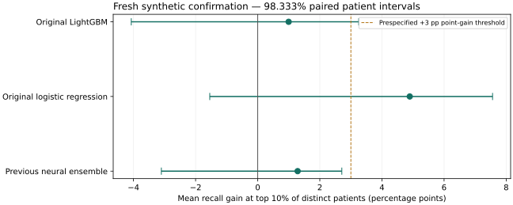

# Patient capture study — synthetic evidence

The frozen patient-list candidate did not pass the complete prespecified synthetic confirmation gate. The results do not justify claiming a confirmed improvement over all three primary controls.

The selected candidate captured **141 of 325 future switchers** across five fresh cohorts, using **286 list places among 2846 distinct eligible historical patients**. Its equal-cohort mean recall was **43.88%**, mean precision **49.41%**, and mean lift **4.37**. These are historical synthetic assessments, not a validated current patient list or evidence of performance on real claims.

## What changed from the previous benchmark

The primary objective is now capture of future switchers in the top 10% of distinct patients. Each patient contributes their latest supplied eligible assessment, chosen using dates only. The earlier study evaluated repeated snapshot opportunities and selected on AP; its headline numbers cannot be directly compared with these patient-level numbers.

The unchanged generator and cohort rules were retained. No latent generator variables, future outcomes or test-selected feature engineering were used. Code-history features, latest-assessment training, ranking losses, additional boosting models, EHR models and cross-family blends were compared on development cohorts.

The previous AP study is preserved at source revision 7d3839621e453c13f7613b6a4e26521e56e723e1. Its already evaluated cohorts 7301–7303 were not reused as fresh confirmation here.

## Reserved test results

Each model is evaluated at exactly the same patient capacity within a cohort. Recall, precision, lift and AP below are equal-cohort averages. Captured counts and list sizes are totals; pooled recall can differ slightly from mean cohort recall.

| model                                  | mean_recall   | mean_precision   |   mean_lift |   mean_ap |   captured |   patients |   positives |   selected |
|:---------------------------------------|:--------------|:-----------------|------------:|----------:|-----------:|-----------:|------------:|-----------:|
| Selected patient-list ensemble         | 43.88%        | 49.41%           |      4.3673 |    0.4794 |        141 |       2846 |         325 |        286 |
| Development-selected classical control | 43.23%        | 48.69%           |      4.303  |    0.4914 |        139 |       2846 |         325 |        286 |
| Original LightGBM                      | 42.88%        | 48.35%           |      4.2671 |    0.4353 |        138 |       2846 |         325 |        286 |
| Previous neural ensemble               | 42.59%        | 48.00%           |      4.2388 |    0.4859 |        137 |       2846 |         325 |        286 |
| Development-selected EHR control       | 40.55%        | 45.56%           |      4.0358 |    0.4813 |        130 |       2846 |         325 |        286 |
| Original logistic regression           | 38.98%        | 44.12%           |      3.8798 |    0.4603 |        126 |       2846 |         325 |        286 |

The top-5% and top-20% sensitivity results are available in [metrics.csv](patient_study/metrics.csv). They are secondary analyses and did not determine model selection.

## Prespecified statistical comparisons

The primary gate requires a point estimate of at least +3 percentage points in mean recall and a lower confidence limit above zero against each original reference and the previous frozen neural ensemble. The 3,000 paired patient bootstrap draws rebuild the top-10% list for every model in every draw. Three Bonferroni-adjusted comparisons use 98.333% confidence intervals at family alpha 0.05.

| reference                    | mean_recall_gain   | ci_lower   | ci_upper   | passes   |
|:-----------------------------|:-------------------|:-----------|:-----------|:---------|
| Original LightGBM            | +1.00 pp           | -4.07 pp   | +3.25 pp   | False    |
| Original logistic regression | +4.90 pp           | -1.54 pp   | +7.56 pp   | False    |
| Previous neural ensemble     | +1.29 pp           | -3.10 pp   | +2.71 pp   | False    |

The gate result is **NOT PASSED**. The intervals condition on these fitted models and synthetic cohorts. They do not establish retraining stability, temporal transportability, causal treatment benefit or real-world superiority. The fixed tuned-classical and best-EHR controls have separately adjusted secondary comparisons in [report.json](patient_study/report.json).

## Captured patients by cohort

Every cell below is the number of labelled future switchers captured, except the three denominator columns.

|   cohort |   eligible_patients |   list_size |   future_switchers |   best_ehr |   candidate |   original_lightgbm |   original_logistic |   previous_neural |   tuned_classical |
|---------:|--------------------:|------------:|-------------------:|-----------:|------------:|--------------------:|--------------------:|------------------:|------------------:|
|     9101 |                 568 |          57 |                 69 |         29 |          29 |                  28 |                  29 |                29 |                29 |
|     9102 |                 550 |          55 |                 56 |         28 |          31 |                  29 |                  25 |                29 |                30 |
|     9103 |                 562 |          57 |                 69 |         25 |          29 |                  31 |                  26 |                29 |                28 |
|     9104 |                 589 |          59 |                 70 |         20 |          25 |                  23 |                  23 |                23 |                25 |
|     9105 |                 577 |          58 |                 61 |         28 |          27 |                  27 |                  23 |                27 |                27 |

The complete cohort results are disclosed, including cohorts where the selected candidate trails a reference.

## Frozen candidate

| model              | family   |   weight | added_history   | latest_training_only   |
|:-------------------|:---------|---------:|:----------------|:-----------------------|
| rank_mlp_True_1.0  | rank_mlp |     0.75 | True            | True                   |
| rank_mlp_False_0.0 | rank_mlp |     0.25 | False           | True                   |

The candidate was chosen from **98 configurations** and **1639 fixed-member/weight proposals** using only development seeds 42, 43 and 44. Its mean development recall was 49.08%, with mean development patient AP 0.4729. Selection optimism is expected; only the reserved results above serve as confirmation.

There were 294 completed configuration/cohort evaluations: 165 exact prior development predictions were reused and 129 new models were fitted. All selected candidate and control models were then refitted on fresh training/validation partitions. There were 55 distinct reserved-cohort fits, with 55 successful serialization/reload checks. All required fits completed before the first reserved test read.

Recipe SHA-256: 3874b9c7890f80607bd50c26bdc130606cc3413bef22a38f3f78a65dbdbe5b0c

The [frozen recipe](patient_study/frozen_recipe.json) records members, weights, source fingerprint, package versions, checkpoint hashes, input manifests and the original protocol. [Development results](patient_study/development_results.csv) and [development summary](patient_study/development_summary.csv) expose every candidate rather than only the winner. Training durations are per-fit wall time under concurrent CPU work, not sequential total runtime; see [fit audit](patient_study/fit_audit.csv) and [inference times](patient_study/inference_times.csv).

## Med-BERT, BEHRT and longitudinal alternatives

The tested transformer is a compact local EHR architecture with event/code, position, alternating-visit and elapsed-time inputs. It has scratch and masked-event-pretrained variants, with and without a wide-feature branch. Pretraining uses only training-patient histories. The reverse-time attention alternative is RETAIN-inspired. These are explicitly local implementations, not original medical checkpoints.

| name                 |   mean_recall |   mean_ap |   cohorts |
|:---------------------|--------------:|----------:|----------:|
| ehr_hybridTrue_pre0  |        0.4732 |    0.4795 |         3 |
| retain_hybrid        |        0.4732 |    0.4737 |         3 |
| ehr_hybridTrue_pre5  |        0.4732 |    0.4702 |         3 |
| ehr_hybridFalse_pre0 |        0.4355 |    0.3486 |         3 |
| ehr_hybridFalse_pre5 |        0.4159 |    0.3963 |         3 |

These development comparisons do not prove that full-scale medical pretraining would be ineffective on real claims. The synthetic code vocabulary is small and is not mapped to ICD concepts. The original [Med-BERT repository](https://github.com/ZhiGroup/Med-BERT#sharing-pre-trained-model) states that its pretrained weights can no longer be shared. No Med-BERT checkpoint was used. Architecture references and the exact training procedure are documented in the [workflow](patient_study_workflow.md).

## Use and limitations

The repository now supports generating a deduplicated top-10% list, fitting the fixed selected recipe on local train/validation partitions, and running the full search/freeze/confirm procedure. See the [patient-list workflow](patient_study_workflow.md) for commands and required inputs.

Operational eligibility must be established upstream at the intended scoring date. The synthetic cohort uses historical conventional-treatment coverage and is not equivalent to proof that every patient remains on generic therapy today. An as-of cutoff cannot repair stale eligibility.

Scores are ranking signals. Do not interpret uncalibrated class-weighted outputs or LambdaRank transformations as individual switch probabilities, clinical recommendations, or expected switcher counts. Probability calibration and the HCP output layer require their own appropriate evaluation.

Results apply to this unchanged synthetic generator and its assumptions. Clinical coding mappings, label observability, claims availability, selection bias, subgroup performance and real temporal holdout validation remain necessary before operational use. The data, row-level lists, fitted models and private environment material are excluded from Git.
